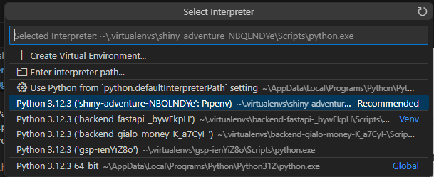

# shiny-adventure

ZooTupe Video downloader graphical user interface on [PySide6](https://doc.qt.io/qtforpython-6/) support for [yt-dlp](https://github.com/yt-dlp/yt-dlp) with a few automation helpers for [ffmpeg](https://ffmpeg.org/) and [pymusiclooper](https://github.com/arkrow/PyMusicLooper).

## Requirements

- pipenv
- Python 3.12
- ffmpeg

## Installing Guides for nerds

0. (Recommended) Install [Visual Studio Code](https://code.visualstudio.com/Download) and the [Python Extension Pack](https://code.visualstudio.com/docs/languages/python)

1. Install Python3
    - Firstly, you need to install Python on your computer if you haven't already. You can download Python from the [official Python website](https://www.python.org/) and install it following the instructions.
    - If you're on linux, Python usually comes with your distro, if not, you need to compile and install using [pyenv](https://github.com/pyenv/pyenv) as there is no prebuilt binaries for linux.
    - Make sure you are installing the recommended version of Python for this project: `3.12.3`

2. Install Package Manager (`pip`)
    - The pip package manager usually comes with Python. However, ensure you have the latest version by upgrading pip:

    - ```python -m pip install --upgrade pip```

3. Install Virtual environment manager
    - Install Pipenv: `pip install pipenv`

4. Create and Install required libraries for the virtual environment
    - First navigate to the project folder
    - Activate the virtual environment: `pipenv shell`
    - Install the necessary libraries for the project: `pipenv install`

5. Install FFmpeg
    - Install [ffmpeg](https://ffmpeg.org/download.html) to your `PATH` (on windows), or from your distro's software manager (on linux)

6. Run Application
    - (Optional) If you are using `Visual Studio Code`, make sure to select the initialized pipenv virtual environment in the `Select Interpreter` menu before continuing.
    - 
    - You can run the project by executing the following command: `pipenv run python main.py`.

## Development

### Setup environment

- Install [Qt Designer](https://build-system.fman.io/qt-designer-download) (recommended) or [Qt Creator](https://www.qt.io/download) (incl. designer)
- (Optional) [Visual Studio Code](https://code.visualstudio.com/Download) (`build-ui` task), or you can run `pipenv run pyside6-uic ./ui/ui.ui -o ./ui/ui.py` to build ui file

### Routine

- Open `ui/ui.ui` in `Qt Designer` to make changes to UI
- Run the task `build-ui` to compile `ui/ui.ui` to `ui/ui.py`
- Import `Ui_MainWindow` from `ui/ui.py` to work with UI components